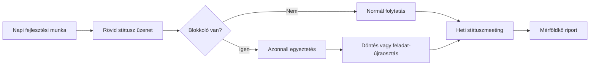

# Kommunikációs és riportolási terv

## 1. Cél

A csapaton belüli információáramlás, státuszriportolás és döntéshozatal egységesítése úgy, hogy a fejlesztési és dokumentációs mérföldkövek időben teljesüljenek.

## 2. Kommunikációs csatornák

| Típus | Eszköz | Cél | Résztvevők |
|---|---|---|---|
| Napi gyors egyeztetés | Messenger/Discord | Blokkolók, napi haladás, rövid döntések | Teljes csapat |
| Heti státuszmeeting | Google Meet | Heti terv vs tény áttekintés, eltéréskezelés | Teljes csapat |
| Verziókövetés és review | GitHub | Kód és dokumentum módosítások nyomon követése | Teljes csapat |
| Dokumentumtár | Google Drive | Beadandó anyagok verziózott tárolása | Teljes csapat |

## 3. Riportolási rend

| Riport | Gyakoriság | Felelős | Tartalom |
|---|---|---|---|
| Rövid státusz | 2-3 naponta | Mindenki | Kész / folyamatban / blokkoló |
| Heti projektjelentés | Hetente | Projektmenedzser | Előrehaladás, kockázatok, következő lépések |
| Mérföldkő riport | Mérföldkő végén | Projektmenedzser | Eredmények, eltérések, döntési javaslat |

## 4. Kommunikációs folyamat diagram

## 5. Döntési és eszkalációs rend

| Szint | Trigger | Döntéshozó | Határidő |
|---|---|---|---|
| Operatív | Kisebb technikai kérdés | Érintett fejlesztő | 24 óra |
| Taktikai | Ütemezési csúszás, scope-eltérés | Projektmenedzser + érintett tag | 48 óra |
| Kritikus | Mérföldkő veszélyben, minőségi blokk | Teljes csapat | Aznap |

## 6. Dokumentálási szabályok

- Minden lényeges döntést röviden rögzíteni kell (dátum, döntés, indok).
- Kódmódosítás előtt és után legyen rövid, egyértelmű commit/leírás.
- Leadás előtt kötelező egy formai és egy tartalmi review kör.
