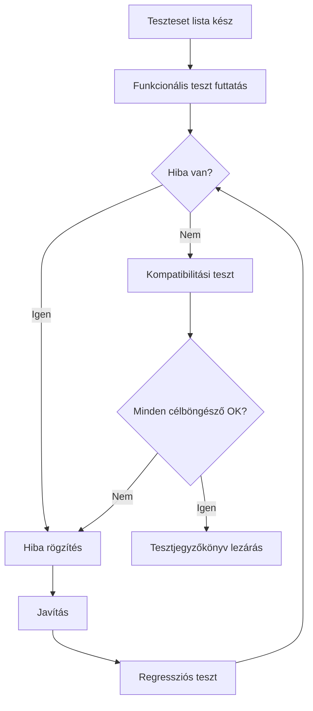

# Minőségbiztosítási és tesztelési terv

## 1. Minőségcélok

- A virtuális zongora fő funkciói stabilan működjenek (egér + billentyűzet input).
- A hangkeltés és vizuális visszajelzés konzisztens legyen.
- Az alkalmazás legalább 3 asztali böngészőben működjön.
- A dokumentáció és tesztjegyzőkönyv konzisztens, visszakövethető legyen.

## 2. Tesztelési stratégia

| Teszttípus | Mit ellenőrzünk | Mikor | Felelős |
|---|---|---|---|
| Funkcionális teszt | Hangkeltés, billentyűreakció, aktív állapot | Fejlesztés végén | Perge György |
| Kompatibilitási teszt | Chrome, Edge, Firefox fő funkciói | Leadás előtt | Kovács Dániel |
| Regressziós teszt | Javítás után meglévő funkciók | Hibajavítás után | Teljes csapat |

## 3. Tesztfolyamat diagram

## 4. Ellenőrzési pontok

- MVP kész: billentyűk látszanak, hang szólal meg.
- Integrált build kész: UI + audio + input együtt működik.
- Release jelölt kész: nincs kritikus nyitott hiba.

## 5. Követhetőségi mátrix (funkció -> teszt)

| Funkció | Teszteset | Elfogadási feltétel |
|---|---|---|
| Egérkattintásos hangkeltés | T1 | Kattintásra helyes hang indul |
| Billentyűzetes hangkeltés | T2 | Kiosztott gombra helyes hang indul |
| Vizuális aktív állapot | T3 | Lenyomáskor aktív, felengedéskor inaktív |
| Gyors leütéssorozat | T4 | Nincs fagyás, folyamatos hangkezelés |
| Böngésző kompatibilitás | T5 | Fő funkciók működnek Chrome/Edge/Firefox alatt |

## 6. Hibakezelési szabályok

| Prioritás | Definíció | Kezelési idő |
|---|---|---|
| Kritikus | Nem működik alapfunkció vagy blokkolja a beadást | 24 órán belül |
| Magas | Jelentős funkcionalitás-csökkenés | 48 órán belül |
| Közepes | Kerülőúttal használható hiba | Következő sprintblokkban |
| Alacsony | Kozmetikai/protokoll hiba | Zárás előtt |

## 7. Kilépési kritériumok leadás előtt

- Nincs nyitott kritikus hiba.
- T1-T5 tesztesetek teljes körben futtatva és dokumentálva.
- Kompatibilitási teszt teljesítve Chrome, Edge, Firefox alatt.
- Tesztjegyzőkönyv véglegesítve és mentve.
