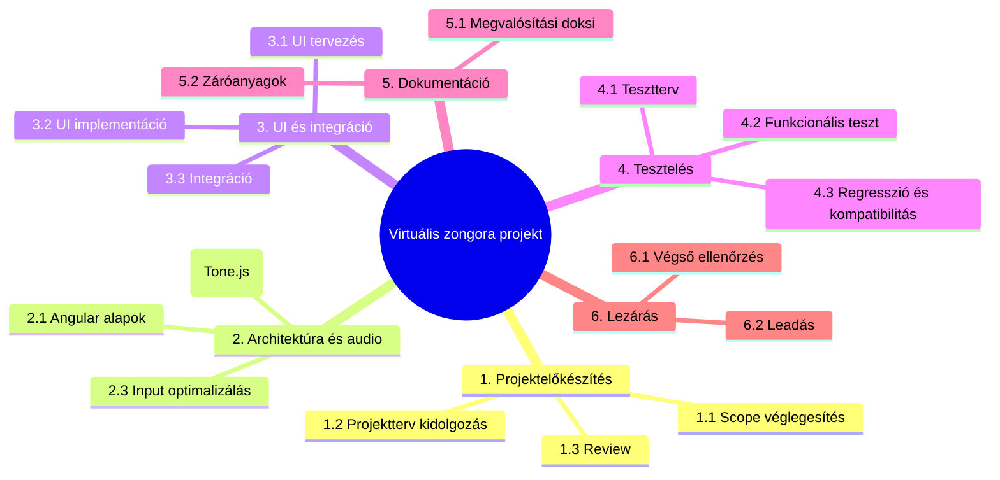
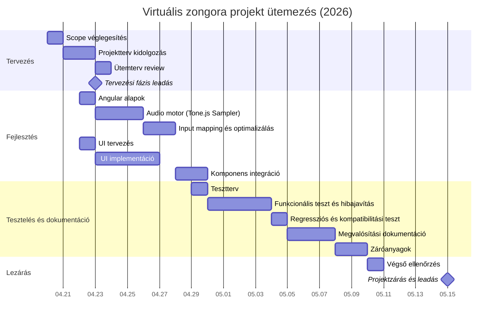
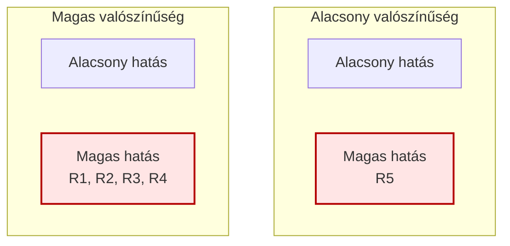
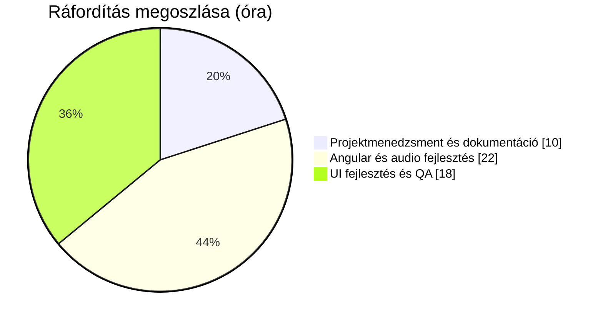

# Projektterv

## Projekt adatai

- Projekt: Virtuális zongora webes alkalmazás
- Csapat: Csizik Viktor, Kovács Dániel, Perge György
- Dokumentum verzió: 1.2
- Készítés dátuma: 2026-04-21
- Kapcsolódó dokumentum: Csizik_Kovács_Perge_PAD

## 1. Tervezési cél

A projektterv célja, hogy a virtuális zongora alkalmazás fejlesztését áttekinthető, mérhető és ütemezett módon támogassa, egyértelmű felelősségekkel és számonkérhető mérföldkövekkel.

Technológiai döntés: a rendszer kizárólag frontend alkalmazásként készül Angular keretrendszerben, Angular Material + SCSS felhasználásával. A hangkeltés kliens oldalon történik Tone.js Sampler alapon (Web Audio API-ra építve), lokális mintatárolással.

## 2. WBS (Work Breakdown Structure)

### 2.1 Főbb feladatok

1. Projektelőkészítés és részletes tervezés
2. Kliens oldali architektúra és audio motor fejlesztése
3. Frontend/UI fejlesztés és integráció
4. Tesztelés és minőségbiztosítás
5. Dokumentáció és záróanyagok
6. Véglegesítés és leadás

### 2.2 Részletes feladatbontás

| WBS | Feladat | Felelős | Kezdés | Vége | Időtartam (nap) | Ráfordítás (óra) | Függés | Kimenet |
|---|---|---|---|---|---:|---:|---|---|
| 1.1 | Követelmények pontosítása, scope véglegesítése | Csizik Viktor | 2026-04-20 | 2026-04-20 | 1 | 2 | - | Rögzített követelménylista |
| 1.2 | WBS, kockázat, költség, erőforrás terv kidolgozása | Csizik Viktor | 2026-04-20 | 2026-04-21 | 2 | 4 | 1.1 | Projektterv v1 |
| 1.3 | Ütemterv és review | Csizik Viktor | 2026-04-21 | 2026-04-21 | 1 | 2 | 1.2 | Elfogadott ütemterv |
| 2.1 | Angular alapok létrehozása (workspace, build, Material) | Kovács Dániel | 2026-04-22 | 2026-04-22 | 1 | 4 | 1.3 | Működő alapprojekt |
| 2.2 | Audio motor implementáció (Tone.js Sampler, mintabetöltés) | Kovács Dániel | 2026-04-22 | 2026-04-24 | 3 | 10 | 2.1 | Működő hangkeltés |
| 2.3 | Input mapping és válaszidő-optimalizálás | Kovács Dániel | 2026-04-24 | 2026-04-25 | 2 | 8 | 2.2 | Stabil input kezelés |
| 3.1 | Virtuális billentyűzet UI tervezés | Perge György | 2026-04-22 | 2026-04-22 | 1 | 3 | 1.3 | UI terv |
| 3.2 | UI implementáció (1-2 oktáv, aktív állapot, SCSS) | Perge György | 2026-04-23 | 2026-04-26 | 4 | 10 | 3.1 | Interaktív zongora UI |
| 3.3 | Komponens-szintű integráció | Kovács Dániel, Perge György | 2026-04-27 | 2026-04-28 | 2 | 5 | 2.3, 3.2 | End-to-end működés |
| 4.1 | Tesztesetek összeállítása | Perge György | 2026-04-29 | 2026-04-29 | 1 | 3 | 3.3 | Tesztterv |
| 4.2 | Funkcionális tesztelés és hibajavítás | Teljes csapat | 2026-04-30 | 2026-05-03 | 4 | 6 | 4.1 | Hibajavított verzió |
| 4.3 | Regressziós és kompatibilitási teszt | Perge György | 2026-05-04 | 2026-05-04 | 1 | 2 | 4.2 | Tesztjegyzőkönyv |
| 5.1 | Megvalósítási dokumentáció elkészítése | Csizik Viktor | 2026-05-05 | 2026-05-07 | 3 | 4 | 4.2 | Leadható dokumentáció |
| 5.2 | Záró prezentáció és pitch videó script | Csizik Viktor | 2026-05-08 | 2026-05-09 | 2 | 3 | 5.1 | Prezentáció és script |
| 6.1 | Végső minőségellenőrzés és csomagolás | Teljes csapat | 2026-05-10 | 2026-05-10 | 1 | 2 | 4.3, 5.2 | Végleges csomag |
| 6.2 | Leadás és retrospektív | Teljes csapat | 2026-05-15 | 2026-05-15 | 1 | 2 | 6.1 | Határidőre leadott anyag |

### 2.3 WBS hierarchia diagram

## 3. Ütemterv (Gantt diagram)

### 3.1 Függőségi háló és kritikus út

```mermaid
flowchart LR
    A[1.1 Scope] --> B[1.2 Projektterv]
    B --> C[1.3 Review]
    C --> D[2.1 Angular alapok]
    D --> E[2.2 Audio motor]
    E --> F[2.3 Input optimalizálás]
    C --> G[3.1 UI tervezés]
    G --> H[3.2 UI implementáció]
    F --> I[3.3 Integráció]
    H --> I
    I --> J[4.1 Tesztterv]
    J --> K[4.2 Funkcionális teszt]
    K --> L[4.3 Regresszió]
    K --> M[5.1 Megvalósítási dokumentáció]
    M --> N[5.2 Záróanyagok]
    L --> O[6.1 Végső ellenőrzés]
    N --> O
    O --> P[6.2 Leadás]

    classDef critical fill:#ffe5e5,stroke:#b30000,stroke-width:2px;
    class A,B,C,D,E,F,I,J,K,L,O,P critical;
```

Kritikus út: 1.1 → 1.2 → 1.3 → 2.1 → 2.2 → 2.3 → 3.3 → 4.1 → 4.2 → 4.3 → 6.1 → 6.2.

## 4. Kockázatelemzés

| ID | Kockázat | Valószínűség (1-5) | Hatás (1-5) | Kockázati szint | Megelőző/kezelő intézkedés | Felelős |
|---|---|---:|---:|---:|---|---|
| R1 | Böngésző kompatibilitási probléma audio rétegben | 3 | 5 | 15 | Korai prototípus 3 böngészőben, fallback beállítások | Kovács Dániel |
| R2 | Dokumentációs feladatok alulbecslése | 4 | 4 | 16 | Heti checkpoint, sablonok előkészítése | Csizik Viktor |
| R3 | Csapattag túlterheltség vizsgaidőszakban | 3 | 4 | 12 | Feladat-újraosztás, kritikus út védése | Teljes csapat |
| R4 | Integrációs hiba komponensek között | 3 | 4 | 12 | Napi build és rövid regresszió | Kovács Dániel |
| R5 | Leadás előtti minőségi hiba | 2 | 5 | 10 | Release checklist és fix freeze | Perge György |

Kockázati szint számítása: valószínűség × hatás.

### 4.1 Kockázati mátrix diagram

## 5. Költségterv

A projekt külső beszerzés nélkül, open source eszközökkel készül. A költségek becsült piaci óradíj alapján kerültek meghatározásra.

| Tétel | Mennyiség | Egységár (Ft/óra) | Összeg (Ft) | Megjegyzés |
|---|---:|---:|---:|---|
| Projektmenedzsment és dokumentáció | 10 óra | 5 500 | 55 000 | Csizik Viktor |
| Angular fejlesztés és audio logika | 22 óra | 6 000 | 132 000 | Kovács Dániel |
| UI fejlesztés és QA | 18 óra | 5 000 | 90 000 | Perge György |
| Infrastruktúra (domain/hosting/dev eszköz) | 1 csomag | - | 10 000 | Minimális üzemeltetési keret |
| Tartalékkeret (10%) | - | - | 28 700 | Kockázati pufferek |
| **Összesen** |  |  | **315 700** |  |

## 6. Erőforrás-terv

### 6.1 Humán erőforrások

| Szerep | Személy | Főbb feladatok | Kapacitás |
|---|---|---|---|
| Projektmenedzser | Csizik Viktor | Tervezés, koordináció, dokumentáció | 2-3 óra/hét |
| Vezető fejlesztő | Kovács Dániel | Angular architektúra, audio motor, integráció | 4-6 óra/hét |
| UI fejlesztő és QA | Perge György | Frontend megvalósítás, tesztelés | 3-5 óra/hét |

### 6.2 Technikai erőforrások

- Angular 20, TypeScript, Angular Material, SCSS
- Tone.js Sampler, lokális zongoraminta fájlok
- Git/GitHub, Drive alapú dokumentumtár
- Célböngészők: Chrome, Edge, Firefox

### 6.3 Ráfordítás-megoszlás diagram

## 7. Gazdaságossági elemzés (NPV)

Az NPV számítás 3 éves időtávra, 10% diszkontrátával készült.

- Kezdeti befektetés (t0): -315 700 Ft
- Várt nettó pénzáramok:
- t1: +140 000 Ft
- t2: +160 000 Ft
- t3: +180 000 Ft
- Diszkontráta: 10%

Képlet:

NPV = -315700 + 140000/(1+0.10)^1 + 160000/(1+0.10)^2 + 180000/(1+0.10)^3

Számítás:

- 140000 / 1.10 = 127 273 Ft
- 160000 / 1.21 = 132 231 Ft
- 180000 / 1.331 = 135 237 Ft

NPV = -315 700 + 127 273 + 132 231 + 135 237 = +79 041 Ft

Következtetés: az NPV pozitív, ezért a projekt gazdaságilag elfogadható.

## 8. Mérföldkövek és elfogadási kritériumok

| Mérföldkő | Határidő | Elfogadás feltétele |
|---|---|---|
| Projektterv leadás | 2026-04-23 | WBS + Gantt + függőségi háló + kockázat + költség + erőforrás + NPV teljes |
| Megvalósítási fázis lezárása | 2026-05-13 | Működő alkalmazás, tesztjegyzőkönyv, hibalista |
| Projektzárás | 2026-05-15 | Záró prezentáció + videó + reflexió |

## 9. Leadás előtti ellenőrzési lista

- [x] Minden kötelező tervezési fejezet szerepel.
- [x] WBS hierarchia és részletes bontás elkészült.
- [x] Gantt diagram függőségekkel és mérföldkövekkel kitöltve.
- [x] Függőségi háló/kritikus út diagram elkészült.
- [x] Kockázati táblázat és kockázati mátrix diagram elkészült.
- [x] Erőforrás- és költségterv, NPV konzisztens.
- [x] Nyelvhelyes, beadásra kész szerkezet.
